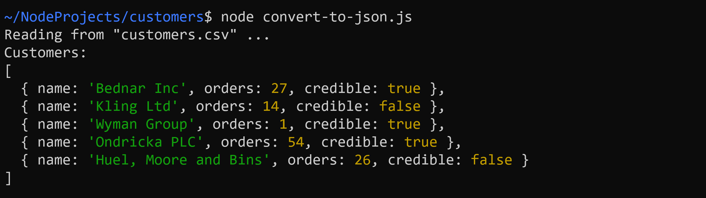
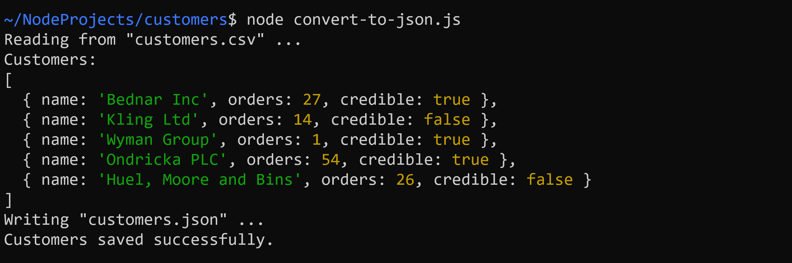

# Customers

## Task 1: Read CSV File

Exportieren Sie in `customer.ts` das darin enthaltene Interface.

Erstellen Sie das Programm `convert-to-json.ts`. Lesen Sie darin die Datei `customers.csv` mithilfe der `fs Promises` API ein und geben Sie den Dateiinhalt auf der Konsole aus.

## Task 2: Create Objects

Erstellen Sie das Array `customers: Customer[]` und speichern Sie darin für jeden eingelesenen Kunden ein Objekt. Geben Sie das Array anschließend auf der Konsole aus.

## Task 3: Write JSON File

Speichern Sie das Array `customers` mithilfe der `fs Promises` API in der Datei `customers.json`.

## Task 4: Read JSON File

Erstellen Sie das Programm `print-credible-customers.ts`. Lesen Sie darin die Datei `customers.json` mithilfe der `fs Promises` API ein. Geben Sie anschließend alle kreditwürdigen Kunden auf der Konsole aus.

